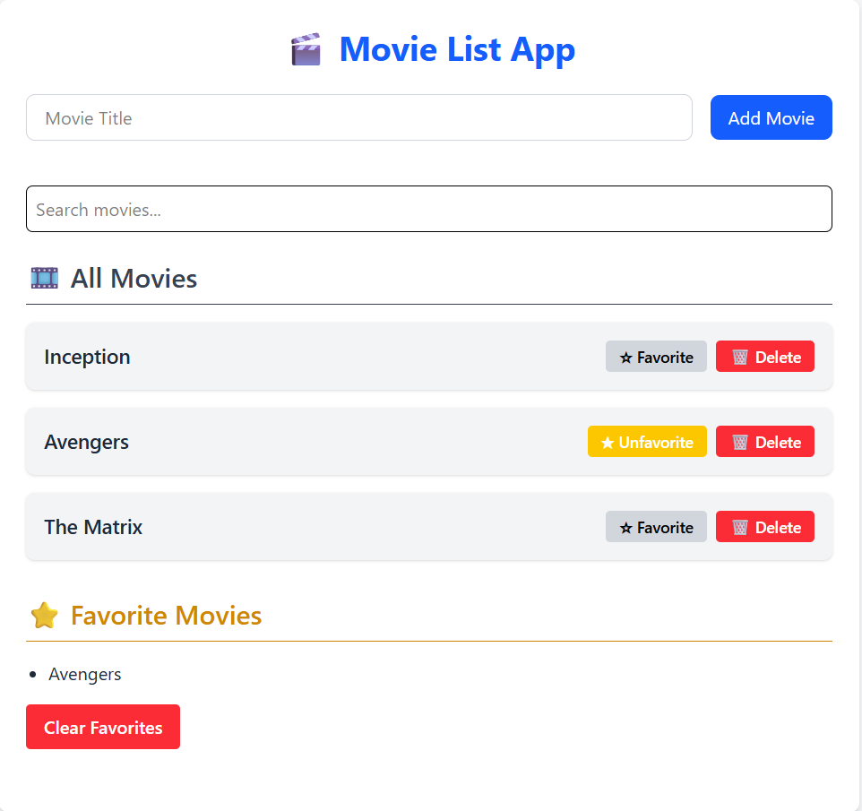

# 🎬 Movie List App
The Movie List App is a simple React application that allows users to browse, add, and search movies.
Users can also mark movies as favorites and view them in a dedicated section.
It demonstrates core React concepts like useState, props, and conditional rendering.

## 👀 Preview


## 📝 Description
A simple movie list app using React where users can:
- 📃 View a list of movies  
- 🔍 Search movies by name  
- ➕ Add new movies  
- ⭐ Mark/unmark favorites  
- ❤️ View favorites in a separate section  

## 🚀 Features
- ⚛️ Functional components  
- 📦 Props and state management (`useState`)  
- 📝 Controlled forms  
- 🔁 Conditional rendering  
- 📋 List rendering with `map`  
- 🖱️ Event handling  
- 💾 LocalStorage persistence  
- 🎨 Basic Tailwindcss styling

## 🔗 Live Preview

You can view the live preview of the project : [🚀 Live Demo](https://movie-list-five-eta.vercel.app/)

## 💻 Tech Stack


## Run the Project
```bash
npm install
npm run dev
